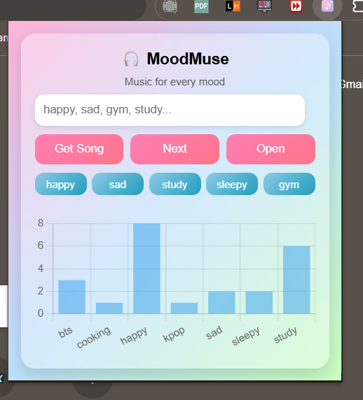
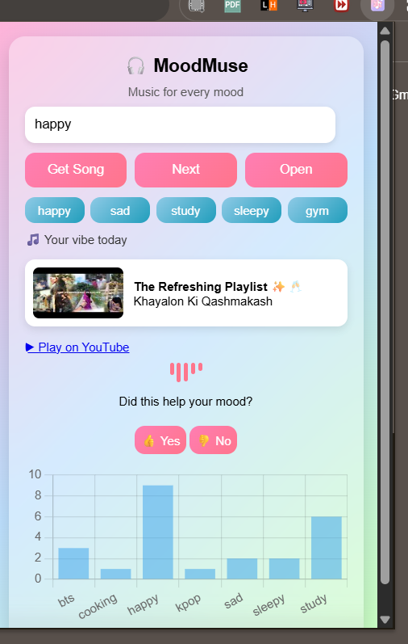

# 🎧 MoodMuse – AI Mood Music Recommender


MoodMuse is a **Chrome Extension that recommends music based on your mood** using AI-inspired mood interpretation and the YouTube Data API.

Instead of manually searching for songs, users can simply **describe their mood**, and MoodMuse will automatically find music that matches the vibe.

---

# ✨ Features

🎵 **Mood-Based Music Recommendation**
Enter your mood and MoodMuse suggests songs that match your emotional state.

🧠 **AI-Inspired Mood Interpretation**
Uses keyword detection and basic sentiment analysis to understand the user's mood.

🔎 **YouTube API Integration**
Fetches real-time music recommendations directly from YouTube.

📊 **Mood Analytics Dashboard**
Tracks mood usage and visualizes it using **Chart.js**.

⚡ **Quick Mood Buttons**
Instant music search for common moods like **happy, sad, study, gym, or sleepy**.

🎛 **Equalizer Animation**
Shows a music visualizer animation when recommendations appear.

👍👎 **Feedback System**
Users can give feedback on recommendations.

💾 **Local Storage Support**
Stores:

* last recommended song
* mood history
* mood analytics data

---

# 📸 Screenshots

### 🎵 Extension Interface

Users can enter their mood and instantly get music recommendations.



---

### 🎧 Music Recommendation Result

The extension recommends a YouTube song and displays mood analytics.



---

# 🛠 Tech Stack

### Frontend

* HTML
* CSS
* JavaScript

### Chrome Extension

* Chrome Extensions API
* Manifest V3
* Chrome Storage API
* Chrome Tabs API

### APIs & Libraries

* YouTube Data API
* Chart.js

---

# 📂 Project Structure

```
MoodMuse/
│
├── manifest.json       # Chrome extension configuration
├── popup.html          # Extension UI
├── popup.js            # Main extension logic
├── moodAI.js           # Mood interpretation logic
├── style.css           # UI styling
├── config.js           # API key configuration
├── chart.js            # Chart.js library
├── icon.png            # Extension icon
├── package.json        # Project metadata
│
├── screenshots/
│   ├── extension-ui.png
│   └── recommendation-result.png
│
└── README.md
```

---

# ⚙️ Installation

### 1️⃣ Clone the repository

```
git clone https://github.com/TushtiSavarn/Moodmuse-ai-music-recommender?tab=readme-ov-file
```

### 2️⃣ Open Chrome Extensions

Go to:

```
chrome://extensions/
```

### 3️⃣ Enable Developer Mode

Turn **Developer Mode ON** in the top right corner.

### 4️⃣ Load the extension

Click:

```
Load Unpacked
```

Then select the **project folder**.

### 5️⃣ Start using MoodMuse

The extension icon will appear in your browser toolbar.

---

# 🔑 API Setup

Create a file named:

```
config.js
```

Add your YouTube API key:

```javascript
const CONFIG = {
  YOUTUBE_API_KEY: "YOUR_API_KEY_HERE"
};
```

You can generate a key from:

**Google Cloud Console → YouTube Data API**

---

# 🚀 How It Works

1️⃣ User enters their mood
Example:

```
"I feel tired today"
```

2️⃣ MoodMuse analyzes the text using:

* sentiment detection
* keyword matching

3️⃣ Mood is converted into a music search query

Example:

```
"I feel tired"
↓
sleepy
↓
"ambient sleep music"
```

4️⃣ The extension sends a request to the **YouTube API**

5️⃣ A random song from the results is recommended to the user.

---

# 📊 Mood Analytics

MoodMuse tracks how often different moods are used.

Example chart:

```
Happy   ██████
Sad     ████
Study   █████████
Gym     ███
Sleepy  ██
```

This helps visualize **music listening patterns**.

---

# 🎯 Future Improvements

Possible upgrades:

* AI-based sentiment analysis using NLP models
* Spotify API integration
* Personalized recommendation system
* Playlist generation
* Machine learning mood classification

---

## 📦 Installing the Extension (Without Chrome Web Store)

1. Download this repository as a ZIP file.

2. Extract the folder.

3. Open Chrome and go to:

```
chrome://extensions/
```

4. Enable **Developer Mode** (top right corner).

5. Click **Load Unpacked**.

6. Select the extension folder.

7. The **MoodMuse extension will now appear in your browser toolbar**.

# 👩‍💻 Author

**Tushti Savarn**
MCA Student | Aspiring AI/ML Engineer

[](https://www.linkedin.com/in/tushti-savarn/)

[](https://medium.com/@tushtisavran)


# 📜 License

MIT License
